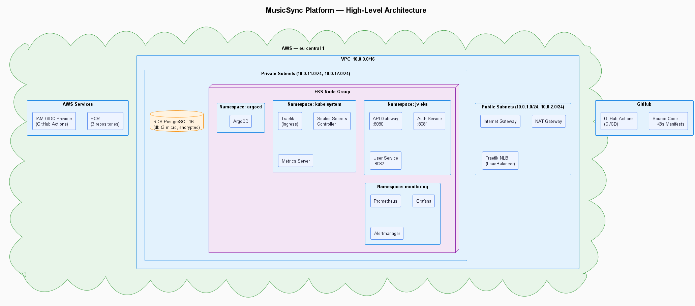
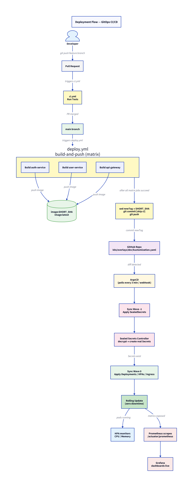
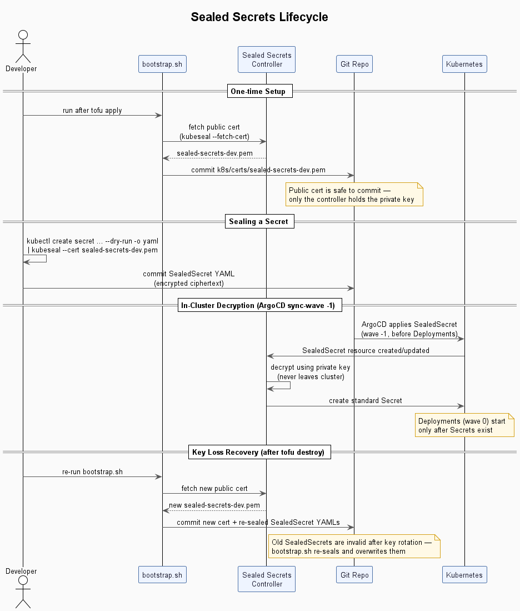

# MusicSync Platform

A microservices platform on AWS EKS demonstrating end-to-end DevOps practices: infrastructure as code, containerisation, GitOps CI/CD, observability, and autoscaling.

---

## Table of Contents

1. [Architecture](#architecture)
2. [Repository Structure](#repository-structure)
3. [Deployment Flow](#deployment-flow)
4. [Infrastructure](#infrastructure)
5. [Kubernetes](#kubernetes)
6. [Observability](#observability)
7. [Scaling & Resilience](#scaling--resilience)
8. [Secrets Management](#secrets-management)

---

## Architecture

Spring Boot services behind a Spring Cloud Gateway, deployed on EKS, backed by RDS PostgreSQL.



## Repository Structure

```
.
├── .github/workflows/
│   ├── ci.yml              # PR checks — runs tests
│   └── deploy.yml          # main branch — build, push, update tags
├── docs/
│   └── diagrams/           # PlantUML + D2 source diagrams
├── infra/tofu/             # OpenTofu (Terraform-compatible) IaC
│   ├── main.tf             # Helm releases (Traefik, ArgoCD, Sealed Secrets,
│   │                       #   Prometheus stack, Metrics Server)
│   ├── modules/
│   │   ├── vpc/            # VPC, subnets, IGW, NAT
│   │   ├── eks/            # Cluster, node group, access entries
│   │   ├── rds/            # PostgreSQL 16, encrypted gp3
│   │   ├── ecr/            # 3 repos + lifecycle policies
│   │   └── iam/            # OIDC provider + GitHub Actions role
│   └── terraform.tfvars
├── k8s/
│   ├── base/               # Environment-agnostic manifests
│   │   ├── auth-service/   # Deployment, Service, ConfigMap, HPA
│   │   ├── user-service/
│   │   ├── api-gateway/
│   │   └── monitoring/     # ServiceMonitor resources
│   ├── overlays/
│   │   ├── dev/            # Image tags, RDS endpoint, SealedSecrets
│   │   └── prod/
│   ├── argocd/             # Application resources (app-dev.yaml, app-prod.yaml)
│   └── certs/              # Sealed Secrets public certs (safe to commit)
├── scripts/
│   └── bootstrap.sh        # One-time post-`tofu apply` initialisation
└── server/                 # Gradle multi-module Spring Boot project
    └── services/
        ├── auth-service/
        ├── user-service/
        └── api-gateway/
```

---

## Deployment Flow



1. **Developer** pushes a feature branch → PR opened.
2. **`ci.yml`** runs tests on every PR and non-main push.
3. PR merged to **`main`** triggers **`deploy.yml`**.
4. **`build-and-push`** job (matrix: 3 services in parallel):
    - Authenticates to AWS via **GitHub Actions OIDC** (no long-lived keys).
    - Builds a 3-stage Docker image (jlink custom JRE → alpine runtime).
    - Pushes `image:SHORT_SHA` + `image:latest` to **ECR**.
5. **`update-manifests`** job commits `newTag: SHORT_SHA` into both overlay `kustomization.yaml` files with `[skip ci]` to avoid loops.
6. **ArgoCD** detects the commit (polls every 3 min). Dev syncs automatically; prod requires a manual sync in the ArgoCD UI.
7. ArgoCD applies resources in **sync-wave order**:
    - Wave `-1`: SealedSecrets → Sealed Secrets controller decrypts → real Secrets created.
    - Wave `0`: Deployments, Services, Ingress, HPAs applied.
8. Kubernetes performs a **rolling update** — zero downtime.

---

## Infrastructure

All infrastructure is provisioned with **Terraform** (`infra/tofu/`). Sensitive variables (`rds_password`, `grafana_admin_password`) are never committed — supplied via `TF_VAR_*` environment variables.

### AWS Resources

| Resource             | Detail                                                                                          |
| -------------------- | ----------------------------------------------------------------------------------------------- |
| **VPC**              | `10.0.0.0/16`, 2 public + 2 private subnets across `eu-central-1a/b`                            |
| **Internet Gateway** | Public subnet egress                                                                            |
| **NAT Gateway**      | Single AZ (cost-optimised) — private subnet egress                                              |
| **EKS**              | K8s 1.33, `t3a.medium` SPOT nodes, 1–2 nodes, `API_AND_CONFIG_MAP` auth mode                    |
| **RDS**              | PostgreSQL 16, `db.t3.micro`, 20 GB gp3, encrypted at rest, private subnet                      |
| **ECR**              | 3 repositories, retain last 3 images, untagged cleaned after 1 day                              |
| **IAM**              | OIDC provider for `token.actions.githubusercontent.com` |

### Helm Releases

| Release               | Chart                                               | Namespace   | Purpose                             |
| --------------------- | --------------------------------------------------- | ----------- | ----------------------------------- |
| traefik               | `traefik/traefik` 34.4.1                            | kube-system | Ingress + NLB                       |
| sealed-secrets        | `bitnami/sealed-secrets` 2.17.3                     | kube-system | Secret decryption controller        |
| argocd                | `argoproj/argo-cd` 7.8.26                           | argocd      | GitOps                              |
| kube-prometheus-stack | `prometheus-community/kube-prometheus-stack` 84.4.0 | monitoring  | Prometheus + Grafana + Alertmanager |
| metrics-server        | `metrics-server/metrics-server` 3.12.2              | kube-system | HPA CPU/memory metrics source       |

---

## Kubernetes

### Base manifests (`k8s/base/`)

Each service has: `Deployment`, `Service` (ClusterIP), `ConfigMap`, `HPA`.  
API Gateway additionally has an `Ingress` (Traefik).  
`monitoring/` contains `ServiceMonitor` resources for Prometheus scraping.

### Overlays (`k8s/overlays/dev/`)

- **Image overrides**: ECR URIs + `newTag` (updated by CI)
- **ConfigMap patches**: RDS endpoint, datasource URL (set by `bootstrap.sh`)
- **SealedSecrets**: `db-secret`, `jwt-secret` (encrypted, safe to commit)
- **Ingress patch**: host `api.jv-eks.dev`

## Observability

### Metrics pipeline

```
Spring Boot Actuator (/actuator/prometheus)
  → ServiceMonitor (scrape config)
    → Prometheus (30s interval)
      → Grafana (PromQL dashboards)
```

## Scaling & Resilience

### Horizontal Pod Autoscaler

| Service      | Min | Max | Scale-up trigger          |
| ------------ | --- | --- | ------------------------- |
| auth-service | 1   | 4   | CPU > 70% OR memory > 80% |
| user-service | 1   | 4   | CPU > 70% OR memory > 80% |
| api-gateway  | 1   | 3   | CPU > 70% OR memory > 80% |

Scale-down stabilisation window: 120 s (prevents thrashing).

### Resource limits

| Service      | CPU request | CPU limit | Memory request | Memory limit |
| ------------ | ----------- | --------- | -------------- | ------------ |
| auth-service | 128m        | 500m      | 256Mi          | 512Mi        |
| user-service | 128m        | 500m      | 256Mi          | 512Mi        |
| api-gateway  | 64m         | 250m      | 128Mi          | 256Mi        |

### Health probes

All services expose `/actuator/health/liveness` and `/actuator/health/readiness` used by Kubernetes liveness and readiness probes.

---

## Secrets Management

Secrets are managed with **Bitnami Sealed Secrets** — never stored in plaintext, safe to commit.

### Lifecycle

1. **One-time**: `bootstrap.sh` fetches the controller's public cert → commits to `k8s/certs/sealed-secrets-dev.pem`.
2. **Sealing**: `kubectl create secret ... --dry-run | kubeseal --cert k8s/certs/sealed-secrets-dev.pem` → commit `SealedSecret` YAML.
3. **In cluster**: Controller decrypts using its private key (never leaves the cluster) → creates a standard `Secret`.
4. **Key loss** (after `tofu destroy`): Re-run `bootstrap.sh` — fetches new cert, re-seals, overwrites old YAMLs.

